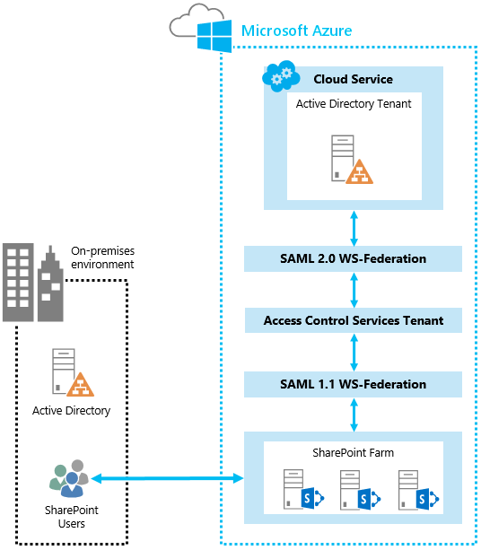
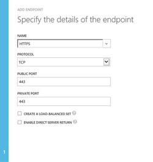
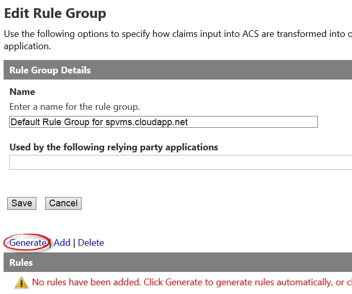
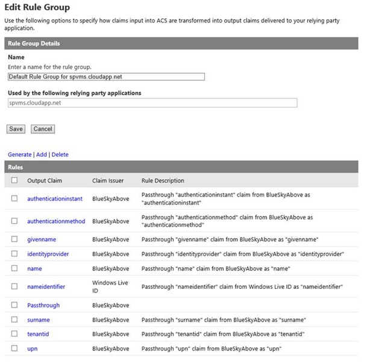
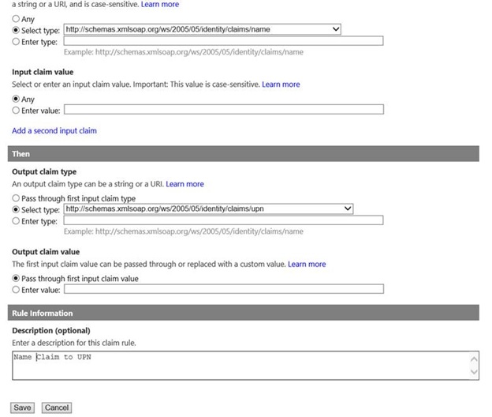
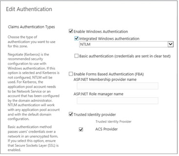

# <a name="using-microsoft-azure-active-directory-for-sharepoint-2013-authentication"></a><span data-ttu-id="07a38-103">Usar Active Directory de Microsoft Azure para autenticación de SharePoint 2013</span><span class="sxs-lookup"><span data-stu-id="07a38-103">Using Microsoft Azure Active Directory for SharePoint 2013 authentication</span></span>

 <span data-ttu-id="07a38-104">**Resumen:** aprenda a usar el Servicio de control de acceso de Azure para autenticar a los usuarios de SharePoint Server 2013 con Azure Active Directory.</span><span class="sxs-lookup"><span data-stu-id="07a38-104">**Summary:** Learn how to use the Azure Access Control Service to authenticate your SharePoint Server 2013 users with Azure Active Directory.</span></span>
  
<span data-ttu-id="07a38-p101">Puede resultarle más sencillo administrar los usuarios si los autentica con distintos proveedores de identidades. Tenga en cuenta lo conveniente que puede resultar usar un proveedor de identidad en el que confía, pero que lo administre otra persona. Por ejemplo, podría tener un tipo de autenticación para los usuarios que tienen acceso a SharePoint Server 2013 en la nube y otro para los usuarios de SharePoint 2013 en su entorno local. El Servicio de control de acceso de Azure permite usar estas opciones.</span><span class="sxs-lookup"><span data-stu-id="07a38-p101">It can be easier to manage your users by authenticating them with different identity providers. Consider how convenient it can be to use an identity provider that you trust, but someone else manages. For example, you could have one type of authentication for users who access SharePoint Server 2013 in the cloud and another for SharePoint 2013 users in your on-premises environment. The Azure Access Control Service makes these choices possible.</span></span> 
  
<span data-ttu-id="07a38-p102">En este artículo se explica cómo puede usar el Servicio de control de acceso de Azure para autenticar los usuarios de SharePoint 2013 con Azure AD, en lugar de usar la instalación local de Active Directory. En esta configuración, Azure AD se convierte en un proveedor de identidad de confianza para SharePoint 2013. Esta configuración agrega un método de autenticación de usuario que es independiente de la autenticación de Active Directory usada por la propia instalación de SharePoint 2013. Para sacarle el máximo partido a este artículo, recomendamos que esté familiarizado con WS-Federation. Para más información, consulte el tema de [introducción a WS-Federation ](https://go.microsoft.com/fwlink/p/?linkid=188052).</span><span class="sxs-lookup"><span data-stu-id="07a38-p102">This article explains how you can use the Azure Access Control Service to authenticate your SharePoint 2013 users with Azure AD, instead of your on-premises Active Directory. In this configuration, Azure AD becomes a trusted identity provider for SharePoint 2013. This configuration adds a user authentication method that is separate from Active Directory authentication used by the SharePoint 2013 installation itself. To benefit from this article, you should be familiar with WS-Federation. For more information, see [Understanding WS-Federation](https://go.microsoft.com/fwlink/p/?linkid=188052).</span></span>
  
<span data-ttu-id="07a38-114">En la siguiente ilustración se muestra cómo funciona la autenticación de los usuarios de SharePoint 2013 en esta configuración.</span><span class="sxs-lookup"><span data-stu-id="07a38-114">The following figure shows how authentication works for SharePoint 2013 users in this configuration.</span></span>
  

  
<span data-ttu-id="07a38-116">El ejemplo que se usa en este artículo lo proporciona Kirk Evans, Arquitecto de Microsoft para el Centro de excelencia de Azure.</span><span class="sxs-lookup"><span data-stu-id="07a38-116">The example used in this article is provided by Kirk Evans, Microsoft Architect for the Azure Center of Excellence.</span></span> 
  
<span data-ttu-id="07a38-117">Para obtener información sobre la accesibilidad de SharePoint 2013, consulte [Accesibilidad para SharePoint 2013](https://go.microsoft.com/fwlink/p/?LinkId=393123).</span><span class="sxs-lookup"><span data-stu-id="07a38-117">For information about SharePoint 2013 accessibility, see [Accessibility for SharePoint 2013](https://go.microsoft.com/fwlink/p/?LinkId=393123).</span></span>
  
## <a name="configuration-overview"></a><span data-ttu-id="07a38-118">Descripción general de la configuración</span><span class="sxs-lookup"><span data-stu-id="07a38-118">Configuration overview</span></span>

<span data-ttu-id="07a38-119">Siga estos pasos generales de configuración del entorno para que use Azure AD como un proveedor de identidad de SharePoint 2013.</span><span class="sxs-lookup"><span data-stu-id="07a38-119">Follow these general steps to set up your environment to use Azure AD as a SharePoint 2013 identity provider.</span></span>
  
1. <span data-ttu-id="07a38-120">Cree un nuevo inquilino y un espacio de nombres de Azure AD.</span><span class="sxs-lookup"><span data-stu-id="07a38-120">Create a new Azure AD tenant and namespace.</span></span>
    
2. <span data-ttu-id="07a38-121">Agregue un proveedor de identidad de WS-Federation.</span><span class="sxs-lookup"><span data-stu-id="07a38-121">Add a WS-Federation identity provider.</span></span>
    
3. <span data-ttu-id="07a38-122">Agregue SharePoint como una aplicación de usuario de confianza.</span><span class="sxs-lookup"><span data-stu-id="07a38-122">Add SharePoint as a relying party application.</span></span>
    
4. <span data-ttu-id="07a38-123">Cree un certificado autofirmado para usarlo con SSL.</span><span class="sxs-lookup"><span data-stu-id="07a38-123">Create a self-signed certificate to use for SSL.</span></span>
    
5. <span data-ttu-id="07a38-124">Cree un grupo de reglas para la autenticación basada en notificaciones.</span><span class="sxs-lookup"><span data-stu-id="07a38-124">Create a rule group for claims-based authentication.</span></span>
    
6. <span data-ttu-id="07a38-125">Configure el certificado X.509.</span><span class="sxs-lookup"><span data-stu-id="07a38-125">Configure the X.509 certificate.</span></span>
    
7. <span data-ttu-id="07a38-126">Cree una asignación de notificaciones.</span><span class="sxs-lookup"><span data-stu-id="07a38-126">Create a claim mapping.</span></span>
    
8. <span data-ttu-id="07a38-127">Configure SharePoint para el nuevo proveedor de identidad.</span><span class="sxs-lookup"><span data-stu-id="07a38-127">Configure SharePoint for the new identity provider.</span></span>
    
9. <span data-ttu-id="07a38-128">Establezca los permisos.</span><span class="sxs-lookup"><span data-stu-id="07a38-128">Set the permissions.</span></span>
    
10. <span data-ttu-id="07a38-129">Compruebe el nuevo proveedor.</span><span class="sxs-lookup"><span data-stu-id="07a38-129">Verify the new provider.</span></span>
    
## <a name="create-azure-ad-tenant-and-namespace"></a><span data-ttu-id="07a38-130">Crear el inquilino y el espacio de nombres de Azure AD</span><span class="sxs-lookup"><span data-stu-id="07a38-130">Create Azure AD tenant and namespace</span></span>

<span data-ttu-id="07a38-p103">Siga estos pasos para crear un nuevo inquilino de Azure AD y un espacio de nombres asociado. En este ejemplo, se usa el espacio de nombres "blueskyabove".</span><span class="sxs-lookup"><span data-stu-id="07a38-p103">Use the following steps to create a new Azure AD tenant and an associated namespace. In this example, we use the namespace "blueskyabove."</span></span> 
  
1. <span data-ttu-id="07a38-133">En el Portal de administración de Azure, haga clic en **Active Directory** y, a continuación, cree un nuevo inquilino de Azure AD.</span><span class="sxs-lookup"><span data-stu-id="07a38-133">In the Azure Management Portal, click **Active Directory**, and then create a new Azure AD tenant.</span></span>
    
2. <span data-ttu-id="07a38-134">Haga clic en **Espacios de nombres de Control de acceso** y cree un nuevo espacio de nombres.</span><span class="sxs-lookup"><span data-stu-id="07a38-134">Click **Access Control Namespaces**, and create a new namespace.</span></span> 
    
3. <span data-ttu-id="07a38-p104">Haga clic en **Administrar** en la barra inferior. Se abrirá esta ubicación: https://blueskyabove.accesscontrol.windows.net/v2/mgmt/web.</span><span class="sxs-lookup"><span data-stu-id="07a38-p104">Click **Manage** on the bottom bar. This should open this location, https://blueskyabove.accesscontrol.windows.net/v2/mgmt/web.</span></span>
    
4. <span data-ttu-id="07a38-p105">Abra Windows PowerShell. Use el módulo Microsoft Online Services para Windows PowerShell, que es un requisito previo para instalar los cmdlets de Azure para Windows PowerShell.</span><span class="sxs-lookup"><span data-stu-id="07a38-p105">Open Windows PowerShell. Use the Microsoft Online Services Module for Windows PowerShell, which is a prerequisite for installing the Azure for Windows PowerShell cmdlets.</span></span>
    
5. <span data-ttu-id="07a38-139">En el símbolo del sistema de Windows PowerShell, escriba el comando  `Connect-Msolservice` y, después, escriba sus credenciales.</span><span class="sxs-lookup"><span data-stu-id="07a38-139">From the Windows PowerShell command prompt, type the command:  `Connect-Msolservice`, and then type your credentials.</span></span>
    
    > [!NOTE]
    > <span data-ttu-id="07a38-140">Para obtener más información sobre cómo usar los cmdlets de Azure para Windows PowerShell, consulte [Administrar Azure AD con Windows PowerShell](https://go.microsoft.com/fwlink/p/?LinkId=393124).</span><span class="sxs-lookup"><span data-stu-id="07a38-140">For additional information about how to use Azure for Windows PowerShell cmdlets, see [Manage Azure AD using Windows PowerShell](https://go.microsoft.com/fwlink/p/?LinkId=393124).</span></span> 
  
6. <span data-ttu-id="07a38-141">En el símbolo del sistema de Windows PowerShell, ejecute estos comandos:</span><span class="sxs-lookup"><span data-stu-id="07a38-141">From a Windows PowerShell command prompt, type the following commands:</span></span>
    
  ```
  Import-Module MSOnlineExtended -Force
  ```

  ```
  $replyUrl = New-MsolServicePrincipalAddresses -Address "https://blueskyabove.accesscontrol.windows.net/"
  ```

  ```
  New-MsolServicePrincipal -ServicePrincipalNames @("https://blueskyabove.accesscontrol.windows.net/") -DisplayName "BlueSkyAbove ACS Namespace" -Addresses $replyUrl
  ```

    <span data-ttu-id="07a38-142">En esta ilustración se muestra el resultado que se obtiene.</span><span class="sxs-lookup"><span data-stu-id="07a38-142">The following figure illustrates the output result.</span></span>
    
     
  
## <a name="add-a-ws-federation-identity-provider-to-the-namespace"></a><span data-ttu-id="07a38-144">Agregar un proveedor de identidad de WS-Federation al espacio de nombres</span><span class="sxs-lookup"><span data-stu-id="07a38-144">Add a WS-Federation identity provider to the namespace</span></span>

<span data-ttu-id="07a38-145">Siga estos pasos para agregar un nuevo proveedor de identidad de WS-Federation al espacio de nombres blueskyabove.</span><span class="sxs-lookup"><span data-stu-id="07a38-145">Use the following steps to add a new WS-Federation identity provider to the blueskyabove namespace.</span></span>
  
1. <span data-ttu-id="07a38-146">Desde el portal de administración de Azure, vaya a **Active Directory** > **Espacios de nombres de Control de acceso**, haga clic en **Crear una nueva instancia** y, a continuación, haga clic en **Administrar**.</span><span class="sxs-lookup"><span data-stu-id="07a38-146">From the Azure management portal, go to **Active Directory** > **Access Control Namespaces**, click **Create a new instance**, and then click **Manage**.</span></span>
    
2. <span data-ttu-id="07a38-147">En el portal de Servicio de control de acceso de Azure, haga clic en **Proveedores de identidades** > **Agregar**, tal y como se muestra en esta ilustración.</span><span class="sxs-lookup"><span data-stu-id="07a38-147">From the Azure Access Control portal, click **Identity Providers** > **Add**, as illustrated in the following figure.</span></span>
    
     
  
3. <span data-ttu-id="07a38-149">Haga clic en **Proveedor de identidad de WS-Federation**, como se muestra en la siguiente ilustración y, después, haga clic en **siguiente**.</span><span class="sxs-lookup"><span data-stu-id="07a38-149">Click **WS-Federation identity provider**, as illustrated in the following figure, and then click **Next**.</span></span>
    
     
  
4. <span data-ttu-id="07a38-p106">Rellene el nombre para mostrar texto del vínculo de inicio de sesión y, después, haga clic en **Guardar**. Para la dirección URL de metadatos de WS-Federation, escriba https://accounts.accesscontrol.windows.net/blueskyabove.onmicrosoft.com/FederationMetadata/2007-06/FederationMetadata.xml. En esta ilustración se muestra la configuración.</span><span class="sxs-lookup"><span data-stu-id="07a38-p106">Fill out the display name and logon link text, and then click **Save**. For the WS-Federation metadata URL, type https://accounts.accesscontrol.windows.net/blueskyabove.onmicrosoft.com/FederationMetadata/2007-06/FederationMetadata.xml. The following figure illustrates the setting.</span></span>
    
     
  
## <a name="add-sharepoint-as-a-relying-party-application"></a><span data-ttu-id="07a38-155">Agregar SharePoint como una aplicación de usuario de confianza</span><span class="sxs-lookup"><span data-stu-id="07a38-155">Add SharePoint as a relying party application</span></span>

<span data-ttu-id="07a38-156">Siga estos pasos para agregar SharePoint como una aplicación de usuario de confianza.</span><span class="sxs-lookup"><span data-stu-id="07a38-156">Use the following steps to add SharePoint as a relying party application.</span></span>
  
<span data-ttu-id="07a38-157">Para obtener más información sobre la configuración de la aplicación de usuario de confianza, consulte [Aplicaciones de usuarios de confianza](https://go.microsoft.com/fwlink/p/?LinkId=393125).</span><span class="sxs-lookup"><span data-stu-id="07a38-157">For additional information about relying party application settings, see [Relying Party Applications](https://go.microsoft.com/fwlink/p/?LinkId=393125).</span></span>
  
1. <span data-ttu-id="07a38-158">En el portal de Servicio de control de acceso de Azure, haga clic en **Aplicaciones de usuario de confianza** y, después, haga clic en **Agregar**, tal y como se muestra en esta ilustración.</span><span class="sxs-lookup"><span data-stu-id="07a38-158">From the Azure Access Control portal, click **Relying party applications**, and then click **Add**, as illustrated in the following figure.</span></span>
    
     
  
## <a name="create-a-self-signed-certificate-to-use-for-ssl"></a><span data-ttu-id="07a38-160">Crear un certificado autofirmado para usarlo con SSL</span><span class="sxs-lookup"><span data-stu-id="07a38-160">Create a self-signed certificate to use for SSL</span></span>

<span data-ttu-id="07a38-161">Siga estos pasos para crear un nuevo certificado autofirmado que usará para las comunicaciones seguras mediante SSL.</span><span class="sxs-lookup"><span data-stu-id="07a38-161">Use the following steps to create a new, self-signed certificate to use for secure communications over SSL.</span></span>
  
1. <span data-ttu-id="07a38-162">Extienda la aplicación web para que use la misma dirección URL que PublishingSite, pero use SSL con el puerto 443, tal y como se muestra en esta ilustración.</span><span class="sxs-lookup"><span data-stu-id="07a38-162">Extend the web application to use the same URL as PublishingSite, but use SSL with port 443, as illustrated in the following figure.</span></span>
    
     
  
2. <span data-ttu-id="07a38-164">En Administrador de IIS, haga doble clic en **Certificados de servidor**.</span><span class="sxs-lookup"><span data-stu-id="07a38-164">In IIS Manager, double-click **Server Certificates**.</span></span>
    
3. <span data-ttu-id="07a38-p107">En el panel **Acciones**, haga clic en **Crear certificado autofirmado**. Escriba un nombre descriptivo para el certificado en el cuadro **Especifique un nombre descriptivo para el certificado** y haga clic en **Aceptar**.</span><span class="sxs-lookup"><span data-stu-id="07a38-p107">In the **Actions** pane, click **Create Self-Signed Certificate**. Type a friendly name for the certificate in the **Specify a friendly name for the certificate** box, and then click **OK**.</span></span>
    
4. <span data-ttu-id="07a38-167">En el cuadro de diálogo **Modificar enlace de sitio**, compruebe que el nombre de host es el mismo que el nombre descriptivo, como se muestra en esta ilustración.</span><span class="sxs-lookup"><span data-stu-id="07a38-167">From the **Edit Site Binding** dialog box, ensure the host name is the same as the friendly name, as illustrated in the following figures.</span></span>
    
     
  
     
  
5. <span data-ttu-id="07a38-170">En el portal de administración de Azure, haga clic en la máquina virtual que quiere configurar y, después, en **Extremos**.</span><span class="sxs-lookup"><span data-stu-id="07a38-170">From the Azure management portal, click the virtual machine that you want to configure, and then click **Endpoints**.</span></span>
    
6. <span data-ttu-id="07a38-171">Haga clic en **Agregar** y luego en **-->** (para Siguiente).</span><span class="sxs-lookup"><span data-stu-id="07a38-171">Click **Add**, and then click **-->** (for Next).</span></span>
    
7. <span data-ttu-id="07a38-172">En **Nombre**, escriba un nombre para el extremo.</span><span class="sxs-lookup"><span data-stu-id="07a38-172">In **Name**, type a name for the endpoint.</span></span>
    
8. <span data-ttu-id="07a38-p108">En **Puerto público** y **Puerto privado**, escriba los números de puerto que quiere usar y, después, active la casilla para finalizar. Estos números pueden ser diferentes. En este artículo usaremos 443, como se muestra en esta ilustración.</span><span class="sxs-lookup"><span data-stu-id="07a38-p108">In **Public Port** and **Private Port**, type the port numbers that you want to use, and then click the check mark to complete. These numbers can be different. For the purposes of this article, we are using 443, as illustrated in the following figure.</span></span>
    
     
  
    > [!NOTE]
    > <span data-ttu-id="07a38-177">Para obtener más información sobre cómo agregar un punto de conexión a una máquina virtual en Azure, consulte [Cómo configurar puntos de conexión en una máquina virtual](https://go.microsoft.com/fwlink/p/?LinkId=393126).</span><span class="sxs-lookup"><span data-stu-id="07a38-177">For additional information about how to add an endpoint to a virtual machine in Azure, see [How to Set Up Endpoints to a Virtual Machine](https://go.microsoft.com/fwlink/p/?LinkId=393126).</span></span> 
  
9. <span data-ttu-id="07a38-178">En el portal de Servicio de control de acceso, agregue un usuario de confianza, como se muestra aquí.</span><span class="sxs-lookup"><span data-stu-id="07a38-178">From the Access Control services portal, add a relying party, as illustrated in the following figure.</span></span>
    
     
  
## <a name="create-a-rule-group-for-claims-based-authentication"></a><span data-ttu-id="07a38-180">Crear un grupo de reglas para la autenticación basada en notificaciones</span><span class="sxs-lookup"><span data-stu-id="07a38-180">Create a rule group for claims-based authentication</span></span>

<span data-ttu-id="07a38-181">Siga estos pasos para crear un nuevo grupo de reglas que controle la autenticación basada en notificaciones.</span><span class="sxs-lookup"><span data-stu-id="07a38-181">Use the following steps to create a new rule group to control claims-based authentication.</span></span>
  
1. <span data-ttu-id="07a38-182">En el panel izquierdo, haga clic en **Grupos de reglas** y, después, elija **Agregar**.</span><span class="sxs-lookup"><span data-stu-id="07a38-182">In the left pane, click **Rule groups**, and then click **Add**.</span></span>
    
2. <span data-ttu-id="07a38-p109">Escriba un nombre para el grupo de reglas, haga clic en **Guardar** y, después, elija **Generar**. En este artículo usaremos **Default Rule Group for. spvms.cloudapp.net**, tal como se muestra en esta ilustración.</span><span class="sxs-lookup"><span data-stu-id="07a38-p109">Type a name for the rule group, click **Save**, and then click **Generate**. For the purposes of this article, we are using **Default Rule Group for. spvms.cloudapp.net**, as illustrated in the following figure.</span></span>
    
     
  
     
  
    > [!NOTE]
    > <span data-ttu-id="07a38-187">Para obtener más información sobre cómo crear grupos de reglas, consulte [Grupos de reglas y reglas](https://go.microsoft.com/fwlink/p/?LinkId=393128).</span><span class="sxs-lookup"><span data-stu-id="07a38-187">For additional information about how to create rule groups, see [Rule Groups and Rules](https://go.microsoft.com/fwlink/p/?LinkId=393128).</span></span> 
  
3. <span data-ttu-id="07a38-p110">Haga clic en el grupo de reglas que quiere cambiar y, después, haga clic en la regla de notificación que desea cambiar. En este artículo agregaremos una regla de notificación al grupo para que pase **name** como **upn**, tal y como se muestra aquí.</span><span class="sxs-lookup"><span data-stu-id="07a38-p110">Click the rule group that you want to change, and then click the claim rule that you want to change. For the purposes of this article, we add a claim rule to the group to pass **name** as **upn**, as illustrated by the following figure.</span></span>
    
     
  
4. <span data-ttu-id="07a38-191">Elimine la regla de notificación existente denominada **upn** y deje la regla **Name Claim to UPN**, como se muestra en esta ilustración.</span><span class="sxs-lookup"><span data-stu-id="07a38-191">Delete the existing claim rule named **upn**, and leave the **Name Claim to UPN** rule, as illustrated by the following figure.</span></span>
    
     
  
## <a name="configure-the-x509-certificate"></a><span data-ttu-id="07a38-193">Configurar el certificado X.509</span><span class="sxs-lookup"><span data-stu-id="07a38-193">Configure the X.509 certificate</span></span>

<span data-ttu-id="07a38-194">Siga estos pasos para configurar el certificado X.509 que va a usar para la firma de tokens.</span><span class="sxs-lookup"><span data-stu-id="07a38-194">Use the following steps to configure the X.509 certificate to use for token signing.</span></span>
  
1. <span data-ttu-id="07a38-195">En el Servicio de control de acceso, en **Desarrollo**, haga clic en **Integración de aplicaciones**.</span><span class="sxs-lookup"><span data-stu-id="07a38-195">In the Access Control Service pane, under **Development**, click **Application integration**.</span></span>
    
2. <span data-ttu-id="07a38-196">En **Referencia de extremo**, busque el archivo **Federation.xml** que está asociado al inquilino de Azure y, después, copie la ubicación en la barra de direcciones de un explorador.</span><span class="sxs-lookup"><span data-stu-id="07a38-196">In **Endpoint Reference**, locate the **Federation.xml** that is associated with your Azure tenant, and then copy the location in the address bar of a browser.</span></span>
    
3. <span data-ttu-id="07a38-197">En el archivo **Federation.xml**, busque la sección **RoleDescriptor** y copie la información del elemento _<X509Certificate>_, como se muestra aquí.</span><span class="sxs-lookup"><span data-stu-id="07a38-197">In the **Federation.xml** file, locate the **RoleDescriptor** section, and copy the information from the _<X509Certificate>_ element, as illustrated in the following figure.</span></span>
    
     
  
4. <span data-ttu-id="07a38-199">En la raíz de la unidad C:\\, cree una carpeta con el nombre **Certificates**.</span><span class="sxs-lookup"><span data-stu-id="07a38-199">From the root of drive C:\\, create a folder named **Certificates**.</span></span>
    
5. <span data-ttu-id="07a38-200">Guarde la información de X509Certificate en la carpeta C:\\Certificates, con el nombre de archivo **AcsTokenSigning.cer**.</span><span class="sxs-lookup"><span data-stu-id="07a38-200">Save the X509Certificate information to the folder C:\\Certificates with the file name, **AcsTokenSigning.cer**.</span></span>
    
    > [!NOTE]
    > <span data-ttu-id="07a38-201">El nombre de archivo debe guardarse con una extensión .cer.</span><span class="sxs-lookup"><span data-stu-id="07a38-201">The file name must be saved with a .cer extension.</span></span> 
  
     
  
## <a name="create-a-claim-mapping-by-using-windows-powershell"></a><span data-ttu-id="07a38-203">Crear una asignación de notificaciones mediante Windows PowerShell</span><span class="sxs-lookup"><span data-stu-id="07a38-203">Create a claim mapping by using Windows PowerShell</span></span>

<span data-ttu-id="07a38-204">Siga estos pasos para crear una asignación de notificaciones mediante Windows PowerShell.</span><span class="sxs-lookup"><span data-stu-id="07a38-204">Use the following steps to create a claim mapping by using Windows PowerShell.</span></span>
  
<span data-ttu-id="07a38-205">Compruebe que tiene las siguientes suscripciones:</span><span class="sxs-lookup"><span data-stu-id="07a38-205">Verify that you have the following memberships:</span></span>
  
1. <span data-ttu-id="07a38-206">Rol fijo de servidor **securityadmin** en la instancia de SQL Server.</span><span class="sxs-lookup"><span data-stu-id="07a38-206">**securityadmin** fixed server role on the SQL Server instance.</span></span>
    
2. <span data-ttu-id="07a38-207">Rol fijo de base de datos **db_owner** en todas las bases de datos que se van a actualizar.</span><span class="sxs-lookup"><span data-stu-id="07a38-207">**db_owner** fixed database role on all databases that will be updated.</span></span>
    
3. <span data-ttu-id="07a38-208">Grupo de administradores en el servidor en el que se van a ejecutar los cmdlets de Windows PowerShell.</span><span class="sxs-lookup"><span data-stu-id="07a38-208">Administrators group on the server on which you are running the Windows PowerShell cmdlets.</span></span>
    
<span data-ttu-id="07a38-209">Un administrador puede usar el cmdlet **Add-SPShellAdmin** para conceder permisos para usar cmdlets de SharePoint 2013.</span><span class="sxs-lookup"><span data-stu-id="07a38-209">An administrator can use the **Add-SPShellAdmin** cmdlet to grant permissions to use SharePoint 2013 cmdlets.</span></span>
  
> [!NOTE]
> <span data-ttu-id="07a38-p111">Si no tiene permisos, póngase en contacto con el administrador para la instalación o con el administrador de SQL Server para pedir los permisos. Para más información sobre los permisos de Windows PowerShell, vea [Add-SPShellAdmin](http://technet.microsoft.com/library/2ddfad84-7ca8-409e-878b-d09cb35ed4aa.aspx).</span><span class="sxs-lookup"><span data-stu-id="07a38-p111">If you do not have permissions, contact your Setup administrator or SQL Server administrator to request permissions. For additional information about Windows PowerShell permissions, see [Add-SPShellAdmin](http://technet.microsoft.com/library/2ddfad84-7ca8-409e-878b-d09cb35ed4aa.aspx).</span></span> 
  
1. <span data-ttu-id="07a38-212">En el menú **Inicio**, haga clic en **Todos los programas**.</span><span class="sxs-lookup"><span data-stu-id="07a38-212">From the **Start** menu, click **All Programs**.</span></span>
    
2. <span data-ttu-id="07a38-213">Haga clic en **Productos de Microsoft SharePoint 2013**.</span><span class="sxs-lookup"><span data-stu-id="07a38-213">Click **Microsoft SharePoint 2013 Products**.</span></span>
    
3. <span data-ttu-id="07a38-214">Elija **Shell de administración de SharePoint 2013**.</span><span class="sxs-lookup"><span data-stu-id="07a38-214">Click **SharePoint 2013 Management Shell**.</span></span>
    
4. <span data-ttu-id="07a38-215">En el símbolo del sistema de Windows PowerShell, escriba este comando para crear una asignación de notificaciones:</span><span class="sxs-lookup"><span data-stu-id="07a38-215">At the Windows PowerShell command prompt, type the following commands to create a claim mapping:</span></span>
    
  ```
  $cert = New-Object System.Security.Cryptography.X509Certificates.X509Certificate2("c:\\certificates\\AcsTokenSigning.cer")
  ```

  ```
  New-SPTrustedRootAuthority -Name "ACS BlueSkyAbove Token Signing" -Certificate $cert
  ```

  ```
  $map = New-SPClaimTypeMapping -IncomingClaimType "http://schemas.xmlsoap.org/ws/2005/05/identity/claims/upn" -IncomingClaimTypeDisplayName "UPN" -SameAsIncoming
  ```

  ```
  $map2 = New-SPClaimTypeMapping -IncomingClaimType "http://schemas.xmlsoap.org/ws/2005/05/identity/claims/givenname" -IncomingClaimTypeDisplayName "GivenName" -SameAsIncoming
  ```

  ```
  $map3 = New-SPClaimTypeMapping -IncomingClaimType "http://schemas.xmlsoap.org/ws/2005/05/identity/claims/surname" -IncomingClaimTypeDisplayName "SurName" -SameAsIncoming
  ```

  ```
  $realm = "urn:sharepoint:spvms"
  ```

  ```
  $ap = New-SPTrustedIdentityTokenIssuer -Name "ACS Provider" -Description "SharePoint secured by SAML in ACS" -realm $realm -ImportTrustCertificate $cert -ClaimsMappings $map,$map2,$map3 -SignInUrl "https://blueskyabove.accesscontrol.windows.net/v2/wsfederation" -IdentifierClaim "http://schemas.xmlsoap.org/ws/2005/05/identity/claims/upn"
  ```

## <a name="configure-sharepoint-for-the-new-identity-provider"></a><span data-ttu-id="07a38-216">Configurar SharePoint para el nuevo proveedor de identidad</span><span class="sxs-lookup"><span data-stu-id="07a38-216">Configure SharePoint for the new identity provider</span></span>

<span data-ttu-id="07a38-217">Siga estos pasos para configurar la instalación de SharePoint para el nuevo proveedor de identidad de Azure AD.</span><span class="sxs-lookup"><span data-stu-id="07a38-217">Use the following steps to configure your SharePoint installation to the new identity provider for Azure AD.</span></span>
  
1. <span data-ttu-id="07a38-218">Compruebe si la cuenta de usuario que lleva a cabo este procedimiento pertenece al grupo de administradores de la granja de servidores de SharePoint.</span><span class="sxs-lookup"><span data-stu-id="07a38-218">Verify that the user account that is performing this procedure is a member of the Farm Administrators SharePoint group.</span></span>
    
2. <span data-ttu-id="07a38-219">En Administración central, en la página de inicio, haga clic en **Administración de aplicaciones**.</span><span class="sxs-lookup"><span data-stu-id="07a38-219">In Central Administration, on the home page, click **Application Management**.</span></span>
    
3. <span data-ttu-id="07a38-220">En la página **Administración de aplicaciones**, en la sección **Aplicaciones web**, haga clic en **Administrar aplicaciones web**.</span><span class="sxs-lookup"><span data-stu-id="07a38-220">On the **Application Management** page, in the **Web Applications** section, click **Manage web applications**.</span></span>
    
4. <span data-ttu-id="07a38-221">Haga clic en la aplicación web correspondiente.</span><span class="sxs-lookup"><span data-stu-id="07a38-221">Click the appropriate web application.</span></span>
    
5. <span data-ttu-id="07a38-222">En la cinta de opciones, haga clic en **Proveedores de autenticación**.</span><span class="sxs-lookup"><span data-stu-id="07a38-222">From the ribbon, click **Authentication Providers**.</span></span>
    
6. <span data-ttu-id="07a38-p112">En **Zona**, haga clic en el nombre de la zona, como por ejemplo, **Predeterminada**.</span><span class="sxs-lookup"><span data-stu-id="07a38-p112">Under **Zone**, click the name of the zone. For example, **Default**.</span></span>
    
7. <span data-ttu-id="07a38-p113">En la página **Editar autenticación** de la sección **Tipos de autenticación de notificaciones**, seleccione **Proveedor de identidad de confianza** y haga clic en el nombre del proveedor, que en este artículo será **ACS Provider**. Haga clic en **Aceptar**.</span><span class="sxs-lookup"><span data-stu-id="07a38-p113">On the **Edit Authentication** page, in the **Claims Authentication Types** section, select **Trusted Identity provider**, and then click the name of your provider, which for purposes of this article is **ACS Provider**. Click **OK**.</span></span>
    
8. <span data-ttu-id="07a38-227">En esta imagen se muestra el valor **Trusted Provider**.</span><span class="sxs-lookup"><span data-stu-id="07a38-227">The following figure illustrates the **Trusted Provider** setting.</span></span>
    

  
## <a name="set-the-permissions"></a><span data-ttu-id="07a38-229">Establecer los permisos</span><span class="sxs-lookup"><span data-stu-id="07a38-229">Set the permissions</span></span>

<span data-ttu-id="07a38-230">Siga estos pasos para establecer los permisos para obtener acceso a la aplicación web.</span><span class="sxs-lookup"><span data-stu-id="07a38-230">Use the following steps to set the permissions to access the web application.</span></span>
  
1. <span data-ttu-id="07a38-231">En la página de inicio de Administración central, haga clic en **Administración de aplicaciones**.</span><span class="sxs-lookup"><span data-stu-id="07a38-231">In Central Administration, on the home page, click **Application Management**.</span></span>
    
2. <span data-ttu-id="07a38-232">En la sección **Aplicaciones web** de la página **Administración de aplicaciones**, haga clic en **Administrar aplicaciones web**.</span><span class="sxs-lookup"><span data-stu-id="07a38-232">On the **Application Management** page, in the **Web Applications** section, click **Manage web applications**.</span></span>
    
3. <span data-ttu-id="07a38-233">Haga clic en la aplicación web adecuada y, a continuación, haga clic en **Directiva de usuario**.</span><span class="sxs-lookup"><span data-stu-id="07a38-233">Click the appropriate web application, and then click **User Policy**.</span></span>
    
4. <span data-ttu-id="07a38-234">En **Directiva de aplicación web**, haga clic en **Agregar usuarios**.</span><span class="sxs-lookup"><span data-stu-id="07a38-234">In **Policy for Web Application**, click **Add Users**.</span></span>
    
5. <span data-ttu-id="07a38-235">En el cuadro de diálogo **Agregar usuarios**, haga clic en la zona apropiada en la sección **Zonas** y, después, haga clic en **Siguiente**.</span><span class="sxs-lookup"><span data-stu-id="07a38-235">In the **Add Users** dialog box, click the appropriate zone in **Zones**, and then click **Next**.</span></span>
    
6. <span data-ttu-id="07a38-236">En el cuadro de diálogo **Agregar usuarios**, escriba user2@blueskyabove.onmicrosoft.com (ACS Provider).</span><span class="sxs-lookup"><span data-stu-id="07a38-236">In the **Add Users** dialog box, typeuser2@blueskyabove.onmicrosoft.com (ACS Provider).</span></span>
    
7. <span data-ttu-id="07a38-237">En **Permisos**, haga clic en **Control total**.</span><span class="sxs-lookup"><span data-stu-id="07a38-237">In **Permissions**, click **Full Control**.</span></span>
    
8. <span data-ttu-id="07a38-238">Haga clic en **Finalizar** y, después, en **Aceptar**.</span><span class="sxs-lookup"><span data-stu-id="07a38-238">Click **Finish**, and then click **OK**.</span></span>
    
<span data-ttu-id="07a38-239">En esta imagen se muestra la sección **Agregar usuarios** de una aplicación web existente.</span><span class="sxs-lookup"><span data-stu-id="07a38-239">The following figure illustrates the **Add Users** section of an existing web application.</span></span>
  

  
## <a name="verify-the-new-provider"></a><span data-ttu-id="07a38-241">Comprobar el nuevo proveedor</span><span class="sxs-lookup"><span data-stu-id="07a38-241">Verify the new provider</span></span>

<span data-ttu-id="07a38-242">Siga estos pasos para comprobar que el nuevo proveedor de identidad funciona. Para ello, asegúrese de que el nuevo proveedor de autenticación aparece en la solicitud de inicio de sesión.</span><span class="sxs-lookup"><span data-stu-id="07a38-242">Use the following steps to verify that the new identity provider is working by ensuring that the new authentication provider appears on the sign-in prompt.</span></span>
  
1. <span data-ttu-id="07a38-243">Inicie sesión con el nuevo proveedor denominado **Blue Sky Above**, tal y como se muestra en esta imagen.</span><span class="sxs-lookup"><span data-stu-id="07a38-243">Sign in by using the new provider named **Blue Sky Above**, as illustrated in the following figure.</span></span>
    
     
  
## <a name="additional-resources"></a><span data-ttu-id="07a38-245">Recursos adicionales</span><span class="sxs-lookup"><span data-stu-id="07a38-245">Additional resources</span></span>

[<span data-ttu-id="07a38-246">Introducción a WS-Federation</span><span class="sxs-lookup"><span data-stu-id="07a38-246">Understanding WS-Federation</span></span>](https://go.microsoft.com/fwlink/p/?linkid=188052)
  
[<span data-ttu-id="07a38-247">Adopción de la nube y soluciones híbridas</span><span class="sxs-lookup"><span data-stu-id="07a38-247">Cloud adoption and hybrid solutions</span></span>](cloud-adoption-and-hybrid-solutions.md)
  
## <a name="join-the-discussion"></a><span data-ttu-id="07a38-248">Participar en la discusión</span><span class="sxs-lookup"><span data-stu-id="07a38-248">Join the discussion</span></span>

|<span data-ttu-id="07a38-249">**Póngase en contacto con nosotros**</span><span class="sxs-lookup"><span data-stu-id="07a38-249">**Contact us**</span></span>|<span data-ttu-id="07a38-250">**Descripción**</span><span class="sxs-lookup"><span data-stu-id="07a38-250">**Description**</span></span>|
|:-----|:-----|
|<span data-ttu-id="07a38-251">**¿Qué soluciones necesita?**</span><span class="sxs-lookup"><span data-stu-id="07a38-251">**What cloud adoption content do you need?**</span></span> <br/> |<span data-ttu-id="07a38-p114">Estamos creando contenido para soluciones que abarcan varios productos y servicios de Microsoft. Díganos qué piensa sobre nuestras soluciones entre servidores o solicite soluciones específicas por correo electrónico a [MODAcontent@microsoft.com](mailto:cloudadopt@microsoft.com?Subject=[Cloud%20Adoption%20Content%20Feedback]:%20).</span><span class="sxs-lookup"><span data-stu-id="07a38-p114">We are creating content for cloud adoption that spans multiple Microsoft cloud platforms and services. Let us know what you think about our cloud adoption content, or ask for specific content by sending email to [cloudadopt@microsoft.com](mailto:cloudadopt@microsoft.com?Subject=[Cloud%20Adoption%20Content%20Feedback]:%20).  </span></span><br/> |
|<span data-ttu-id="07a38-254">**Participe en la discusión sobre soluciones**</span><span class="sxs-lookup"><span data-stu-id="07a38-254">**Join the cloud adoption discussion**</span></span> <br/> |<span data-ttu-id="07a38-p115">Si es un apasionado de las soluciones basadas en la nube, puede unirse a Cloud Adoption Advisory Board (CAAB) para conectarse a una interesante comunidad de mayor tamaño formada por desarrolladores de contenido de Microsoft, profesionales del sector y clientes de todo el mundo. Para unirse, agregue a su usuario como miembro del [espacio CAAB (Cloud Adoption Advisory Board)](https://aka.ms/caab) de Microsoft Tech Community y envíenos un correo electrónico a [CAAB@microsoft.com](mailto:caab@microsoft.com?Subject=I%20just%20joined%20the%20Cloud%20Adoption%20Advisory%20Board!). Cualquiera puede leer contenido relacionado con la comunidad en el [blog de CAAB](https://blogs.technet.com/b/solutions_advisory_board/). Pero los miembros de CAAB reciben invitaciones a seminarios web privados donde se describen nuevos recursos y soluciones de adopción de la nube.  </span><span class="sxs-lookup"><span data-stu-id="07a38-p115">If you are passionate about cloud-based solutions, consider joining the Cloud Adoption Advisory Board (CAAB) to connect with a larger, vibrant community of Microsoft content developers, industry professionals, and customers from around the globe. To join, add yourself as a member of the [CAAB (Cloud Adoption Advisory Board) space](https://aka.ms/caab) of the Microsoft Tech Community and send us a quick email at [CAAB@microsoft.com](mailto:caab@microsoft.com?Subject=I%20just%20joined%20the%20Cloud%20Adoption%20Advisory%20Board!). Anyone can read community-related content on the [CAAB blog](https://blogs.technet.com/b/solutions_advisory_board/). However, CAAB members get invitations to private webinars that describe new cloud adoption resources and solutions.  </span></span><br/> |
|<span data-ttu-id="07a38-258">**Obtenga los archivos de arte que ve aquí**</span><span class="sxs-lookup"><span data-stu-id="07a38-258">**Get the art you see here**</span></span> <br/> |<span data-ttu-id="07a38-p116">Si quiere recibir una copia editable de las ilustraciones que se muestran en este artículo, estaremos encantados de enviárselas. Envíe su solicitud por correo electrónico, incluida la dirección URL y el título de la ilustración, a [cloudadopt@microsoft.com](mailto:cloudadopt@microsoft.com?subject=[Art%20Request]:%20).  </span><span class="sxs-lookup"><span data-stu-id="07a38-p116">If you want an editable copy of the art you see in this article, we'll be glad to send it to you. Email your request, including the URL and title of the art, to [cloudadopt@microsoft.com](mailto:cloudadopt@microsoft.com?subject=[Art%20Request]:%20).  </span></span><br/> |
   

